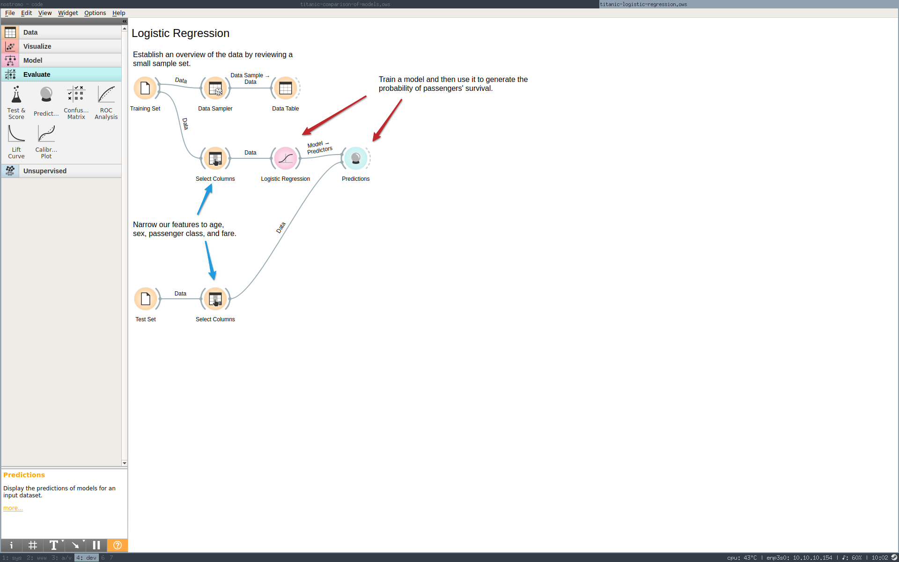
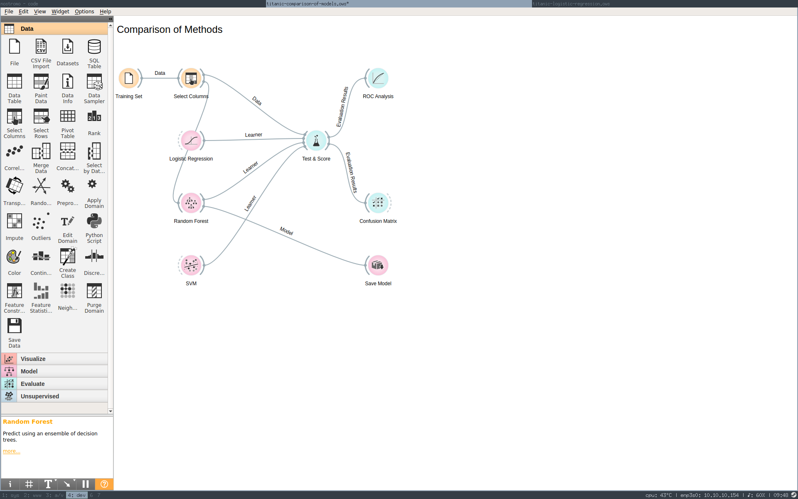
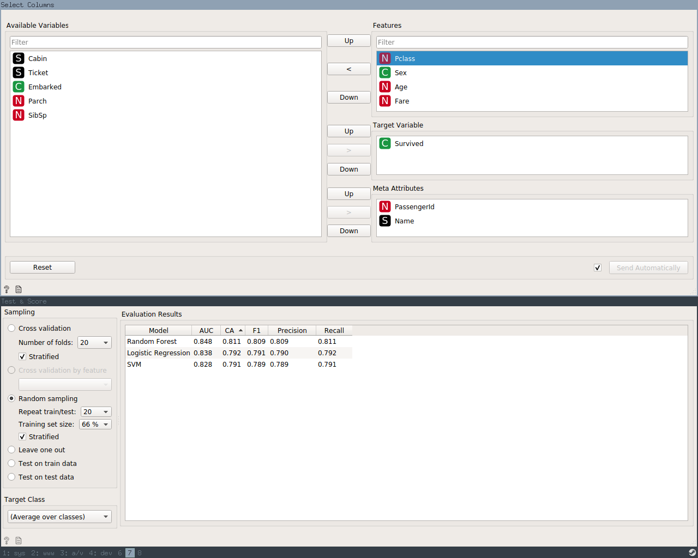
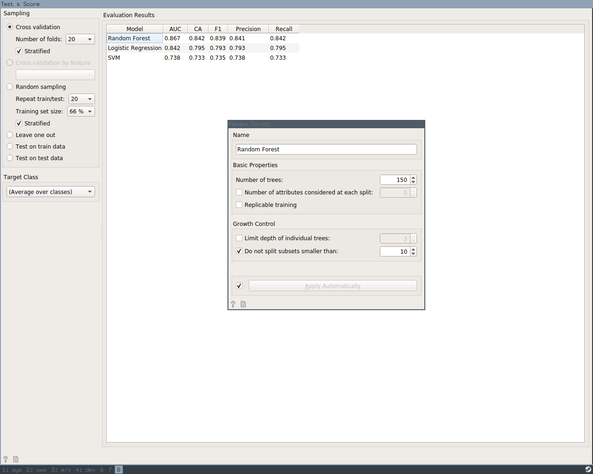

# Titanic Survival Dataset

## Prelude

To start, I elect to use Python + Orange.

- Previous experience
- Reputation for ease of use
- Visual interface for quick filtering and spot validation
- Rapid prototyping before wasting time on custom code
- Programmatic library to dump an archivable representation

This is a pretty small dataset, so I'm unconcerned with scaling this approach at the moment.

## Incremental Refinement

### Logistic regression

I create a file widget, load the training CSV, sample the data down, and spit out to a table. At
first glance, I suspect I should drop some of these columns when building our model -- `Name`,
`Ticket`, `Cabin`. `PassengerId` is clearly our unique anchor point here and `Survived` is our
indicator variable. Based on what I know about the Titanic disaster, `Age`, `Sex`, and `Fare` seem
like good candidates for predictors (though age data appears to be missing in a number of cases).
I'm unclear on what `Parch`, `SibSp`,  and `Embarked` represent and whether they should be included.
I would assume `Pclass` is passenger class and imagine that may be relevant.

I create a another file widget, load the test CSV, and narrow both datasets to the aforementioned
features -- age, sex, and fare. Next, I use the training data to build a logistical regression model
which I subsquently feed along with the test dataset into a predictions widget. A cursory review of
the results corresponds with the summary notes -- women fared better than men, first class
passengers fared better than the others, etc.



This seems like an ideal point to backtrack and see if I can find out a little more about my
dataset. From [the following link][titanic-meta], I am able to uncover the following:

- `Pclass` is indeed passenger class -- 1st, 2nd, or 3rd
- `Embarked` is port of embarkation -- (C = Cherbourg; Q = Queenstown; S = Southampton)
- `SibSp` is number of siblings/spouses aboard
- `Parch` is number of parents/children aboard

Armed with this knowledge, I feel that port of embarkation is likely irrelevant and passenger class
is likely quite important as a proxy for social class. The other two are interesting because they
might indicate whether whole families were more likely to survive as a unit versus individuals;
however, I am wary of adding too many parameters and [overfitting][overfitting].

### Branching out

At this point, it's good to pause. A logistic regression is one option for classification, but
Orange packs several others including random forest and SVM. By performing cross-validation on the
training dataset, we can compare models for accuracy before applying the best option to our test
dataset.



Using the default settings for all classifiers, I found that out of the gate the random forest
classifier returned the best cross-validation scores of the three methods -- SVM, random forest, and
logistic regression. The SVM performed more poorly than I expected given the little I know about it.
By adding the `SibSp` and `Parch` features back into the dataset, I was able to improve its overall
accuracy, but not enough to recommend it. 



Initial accuracy scores for random forest classifier hovered around 80%. By increasing the number
of decision trees and experimenting with subset size, I was able to get this score closer to 84%.



## A Refined Classifier

Having prototyped and explored my basic options for prediction, Orange has met my original goal --
fast time to working prototype. Let's jump into a [Jupyter notebook](titanic.ipynb) to explore the
exported model as well as an alternate approach to tuning.

## References

- https://stackoverflow.com/questions/6336733/i-want-forecast-prediction-algorithms-lists-that-i-can-try-for-the-sample-exper
- https://orange.biolab.si/
- https://en.wikipedia.org/wiki/Logistic_regression
- https://en.wikipedia.org/wiki/Overfitting
- http://www.stat.cmu.edu/~cshalizi/uADA/12/lectures/ch12.pdf
- http://campus.lakeforest.edu/frank/FILES/MLFfiles/Bio150/Titanic/TitanicMETA.pdf
- https://www.analyticsvidhya.com/blog/2015/06/tuning-random-forest-model/
- https://en.wikipedia.org/wiki/Hyperparameter_optimization 

## Reproducing results

After encountering issues with using [pipenv][pipenv], I opted to use [miniconda](https://docs.conda.io/en/latest/miniconda.html) to handle Python libraries.

Dependencies can be installed with:

```
conda env create -f environment.yml
conda activate titanic
```

The Orange UI can be loaded to view the included `*.ows` files by running:

```
orange-canvas
```

The Jupyter notebook can be viewed by running:

```
jupyter notebook
```

[titanic-meta]: http://campus.lakeforest.edu/frank/FILES/MLFfiles/Bio150/Titanic/TitanicMETA.pdf
[overfitting]: https://en.wikipedia.org/wiki/Overfitting
[pipenv]: https://docs.pipenv.org/en/latest/
